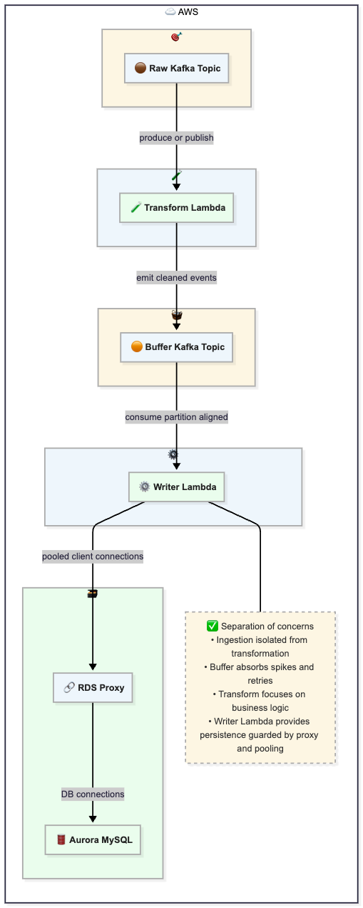
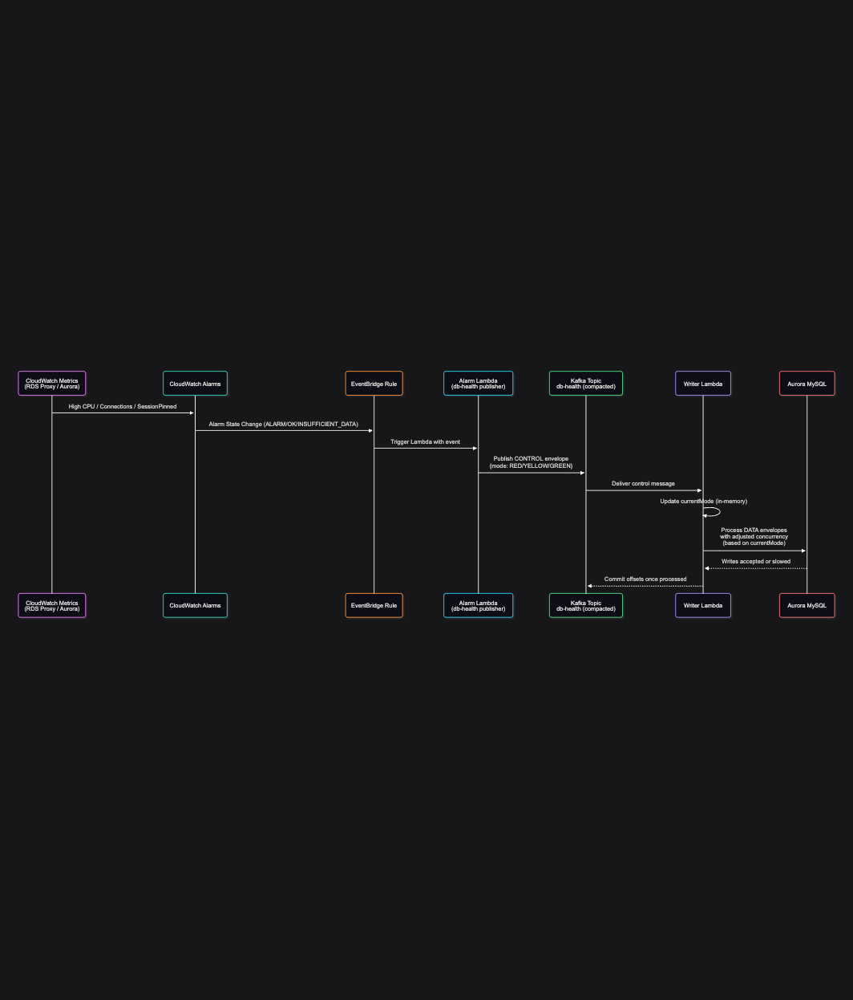

# Demo Explained

The purpose of the demo is to show how to design a resilient system that can handle production challenges. It consists of multiple tips and tricks used to deal with backpressure, spikes in traffic, and proactively react to unexpected changes in the target system. Kafka is designed to stream a huge number of messages in real time, but what about the other components?
<br /><br />
Lambda can scale aggressively and, in its frenzy, respond to the demand and heavy load introduced by Kafka, but that is only part of the story. What happens with the RDS database and the other parts of the system? What can we do to avoid being a noisy neighbor? How do we avoid overprovisioning components and paying huge amounts of money for infrastructure, while still fulfilling business requirements?
<br /><br />
We will start by explaining separation of concerns, why it is important, and follow the happy path. Then we will move to the situation where our DB cluster is under heavy pressure from other services and consumers. Finally, we will show how to adapt based on live metrics and alarms.

## Architecture Diagram



**Formula for partitions (P):**

Before I made this calculation, I load tested my infrastructure and measured latency. My batch, or rather chunk, of 30 messages was processed in between 0.15 and 0.20 seconds. I am adding a 30% safety buffer in case of increased latency or unexpected lag.

P = max( 1 , ceil( (T x t x f) / B ) )

Where:

| Symbol | Meaning                                    |
| ------ | ------------------------------------------ |
| T      | Target TPS (messages per second)           |
| t      | Processing time per batch (seconds)        |
| B      | Batch size (records per batch)             |
| f      | Safety factor (buffer for spikes, 1.3–1.5) |
| P      | Required number of Kafka partitions        |

Given:
T = 500 TPS
t = 0.2 s
f = 1.3
B = 30

Compute:
500 x 0.2 = 100
100 x 1.3 = 130
130 / 30 = 4.33
ceil(4.33) = 5

Result: **P = 5 partitions**

With 5 concurrent writers (1 per partition), the maximum client connections are:

ClientConnections = P x ConnectionLimit
ClientConnections = 5 x 2 = 10
(where connectionLimit on the pool is set to 2).

We split a batch of 30 rows into 2 queries of 15 rows each. The database connections remain around:

DBConnections = P x CHUNK_CONCURRENCY
DBConnections = 5 x 2 = 10

This allows the RDS Proxy to reuse database connections effectively.
We can even reduce the number of connections further to demonstrate the point.

### Alarm Setup

- When CPU bursts past 40%, the alarm triggers and a control message is sent to the control topic with mode RED.
- The message is also written to Parameter Store so it is available on cold start in the Writer Function.
- Warm Lambdas continue to catch live changes from the control topic, which is updated when the alarm is activated and the Lambda is triggered to produce a message.
- The Writer Lambda reduces processing to one chunk at a time.
- As traffic slows down, CPU drops below 40%, the alarm deactivates, and mode switches to GREEN.
- The Writer Lambda then returns to maximum concurrency.

This demonstrates adaptive behavior based on database load.

### Alarm Mappings for the Demo

- ALARM state -> maps to RED -> Writer throttles down to 1 chunk at a time.
- INSUFFICIENT_DATA -> maps to YELLOW -> moderate: 2 chunks.
- OK -> maps to GREEN -> Full concurrency.

### Sequence Diagram



## How To Generate Traffic

Check the defaults within the file and tailor it as you wish.

```bash
chmod +x ./demo.sh
./demo.sh
```
